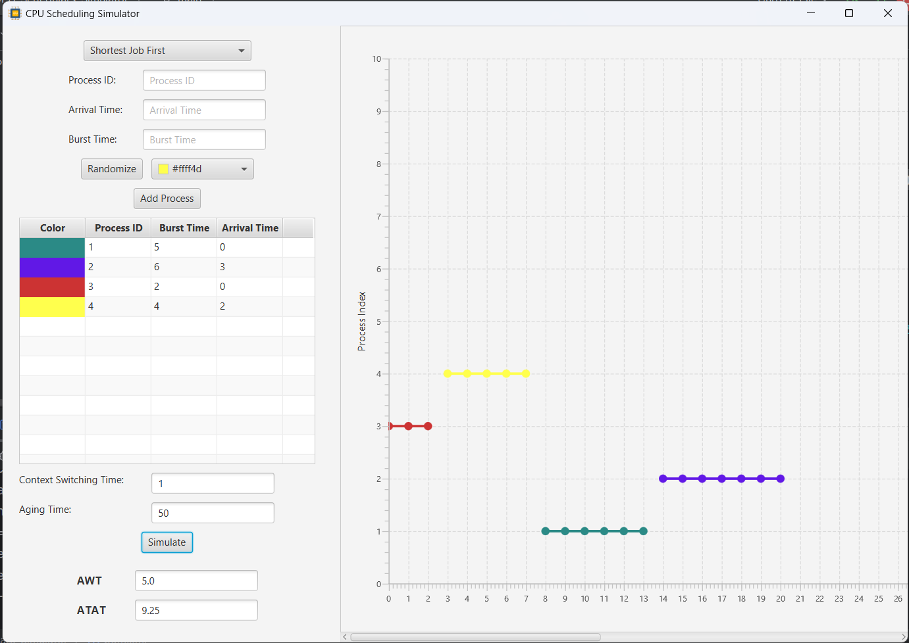
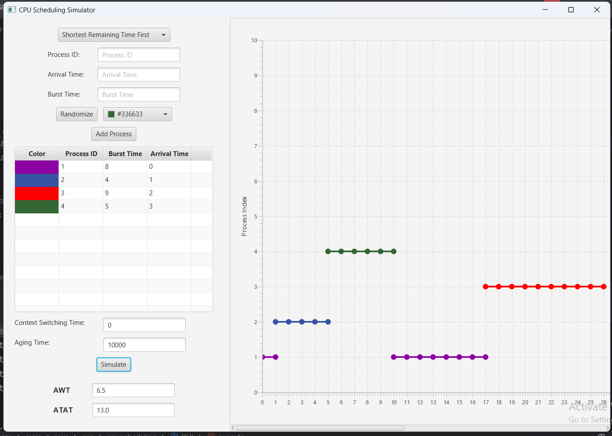
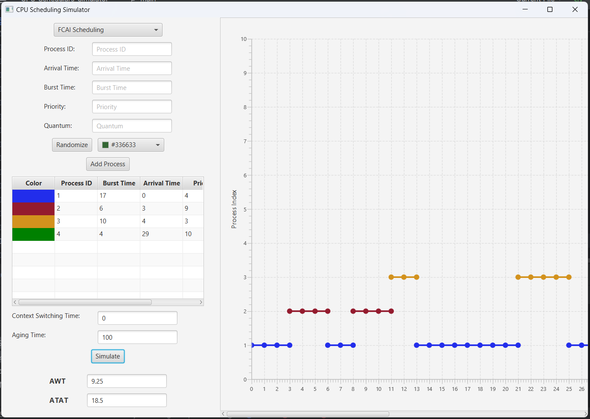

<h1 style="display: flex; justify-content: center; align-items: center">
  
   CPU Schedulers Simulator
  
</h1>

## Overview

**CPU scheduling** is a core aspect of operating system design, determining the execution order of processes when multiple are ready to run. This project simulates various CPU scheduling algorithms to illustrate their behavior, efficiency, and solutions to common scheduling challenges like starvation.

The **CPU Scheduling Simulator** is a Java application with a JavaFX GUI, providing an interactive and visual representation of the scheduling process. Users can explore and compare multiple scheduling algorithms, including a custom adaptive scheduler called **FCAI Scheduler**.
## Features
This simulator implements the following scheduling algorithms:

1. Non-Preemptive Priority Scheduler
   - Uses context switching to manage processes.
   - Processes are selected based on priority.

2. Non-Preemptive Shortest Job First (SJF) Scheduler

   - Prioritizes processes with the shortest burst time.
   - Includes a solution for the starvation problem.
3. Shortest Remaining Time First (SRTF) Scheduler

   - A preemptive algorithm where processes are prioritized based on the remaining burst time.
   - Addresses the starvation problem through fair scheduling policies.
4. FCAI Scheduler (Custom Scheduler)

   - An adaptive approach that dynamically adjusts execution order based on:
      - Priority (P)
      - Arrival Time (AT)
      - Remaining Burst Time (RBT)
   - Incorporates unique quantum allocation rules:
      - **Dynamic FCAI Factor**: Combines priority, arrival time, and remaining burst time using the formula:
     
        - `FCAI Factor = (10 − Priority) + (Arrival Time / V1) + (Remaining Burst Time / V2)`
        - `V1: Last arrival time of all processes / 10`
        - `V2: Max burst time of all processes / 10`
      - **Quantum updates:**
           - `Q = Q + 2` (if process completes its quantum but still has work).
           - `Q = Q + unused quantum` (if process is preempted).
   - Execution rules:
      - Non-preemptive for the first 40% of quantum.
      - Preemptive afterward.

## JavaFX GUI
The simulator features a JavaFX-based graphical user interface for:

- Visualizing process execution timelines.
- Adjusting process parameters like priority, arrival time, and burst time.
- Comparing algorithms through real-time results.

## Contributions
- Sherif Youssef
- Daniel Sameh
- Omar Saleh
- Osama Refaat
- Mohamed Hesham

Contributions are welcome! Feel free to open issues or submit pull requests for new features, bug fixes, or improvements.